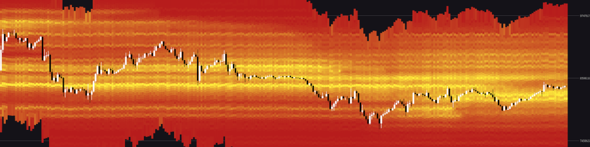

# Overmind: AI-Powered Trading Algorithm

## Overview

Overmind is a front-end GUI for a sophisticated trading algorithm leveraging machine learning and artificial intelligence to optimize trading strategies. This algorithm, under development since 2015 as part of a PhD thesis, is meticulously crafted from the ground up, prioritizing performance, accuracy, and adaptability within financial markets.

The core algorithm uses a heavily modified implementation of fuzzy inference systems, drawing inspiration from deep learning neural networks, clustering techniques, and established financial analysis methods. Optimized for speed, Overmind can execute over one million trades in under a minute.

**Key Features:**

*   **AI-Powered Trading:**  Leverages a unique blend of fuzzy logic, neural networks, and financial analysis for intelligent trading decisions.
*   **High-Performance Execution:** Engineered for speed, capable of executing over a million trades per minute.
*   **Individualized Trading Models:**  Each user's model is unique, tailored to their specific data and risk profile. This prevents front-running and market manipulation.
*   **Customizable Strategies:**  Users can tailor their models to specific needs:
    *   Short-term vs. Long-term trading
    *   Specific cryptocurrency or asset focus
    *   Risk tolerance levels
*   **Open-Source GUI:** Provides a transparent and auditable interface for interacting with the trading algorithm.
*   **Local API Key Storage:** Securely stores exchange API keys on the user's machine, preventing exposure to external servers.
*   **Community Driven:**  Encourages contributions and enhancements from the open-source community.

## Architecture and Security

The Overmind architecture is designed for both performance and security:

*   **Decentralized Model:** Each user runs a personalized trading model based on the core algorithm, ensuring that strategies remain private and resistant to manipulation.
*   **Open-Source GUI for Transparency:**  This repository contains the front-end GUI, allowing users to examine the code and verify that their API keys and sensitive data remain secure on their local machine.
*   **Local API Key Management:** The GUI never transmits API keys to external servers. Keys are stored securely on the user's device, providing a layer of protection against data breaches.

**Important Security Note:**  While the GUI is designed to be secure, users are ultimately responsible for safeguarding their exchange/broker API keys. Exercise caution when granting API permissions and regularly review your exchange's security settings.

## Getting Started

## Contributing

We welcome contributions to Overmind!  If you're interested in helping improve the project, please:

1.  Fork the repository.
2.  Create a new branch for your feature or bug fix.
3.  Implement your changes.
4.  Write tests to ensure your changes are working correctly.
5.  Submit a pull request.

**Areas for contribution include:**

*   Developing new trading modules.
*   Improving the GUI interface.
*   Adding support for additional exchanges/brokers.
*   Writing documentation.
*   Bug fixes.

## License

This project is licensed under the [GNU General Public License v3.0](LICENSE). See the `LICENSE` file for details.

## Disclaimer

Trading involves significant risks, and you can lose money. The Overmind algorithm and this GUI are provided "as is" without any warranty, express or implied. The developers of Overmind are not responsible for any losses incurred as a result of using this software. Use at your own risk. It is crucial to understand the risks involved in trading and to only trade with capital you can afford to lose.  **This is not financial advice.**
